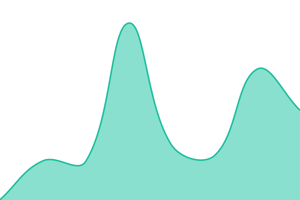
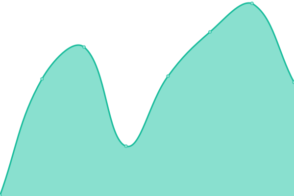
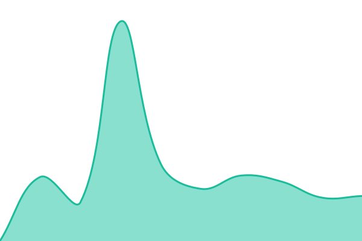
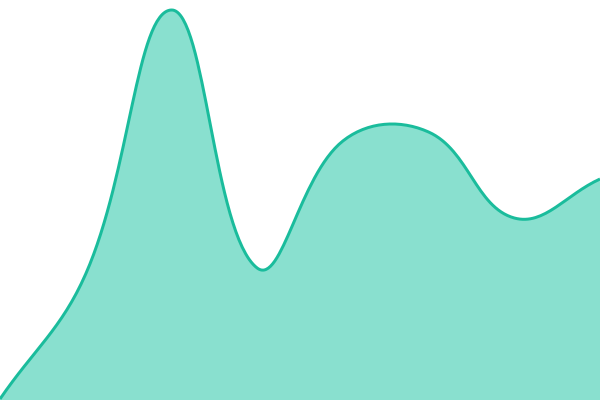
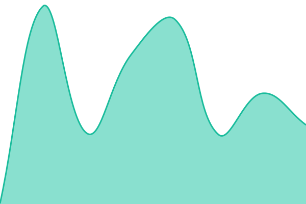
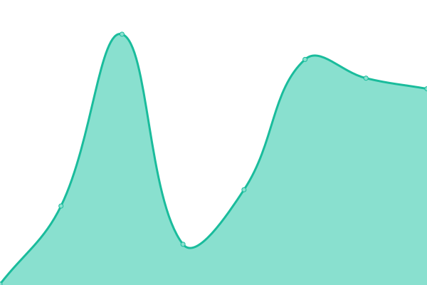

# [📈 Live Status](https://demo.upptime.js.org): <!--live status--> **🟧 Partial outage**

This repository contains the open-source uptime monitor and status page for [Upptime](https://upptime.js.org), powered by [Upptime](https://github.com/upptime/upptime).

With [Upptime](https://upptime.js.org), you can get your own unlimited and free uptime monitor and status page, powered entirely by a GitHub repository. We use [Issues](https://github.com/upptime/upptime/issues) as incident reports, [Actions](https://github.com/martin-sun/woohelps-upptime/actions) as uptime monitors, and [Pages](https://demo.upptime.js.org) for the status page.

<!--start: status pages-->
<!-- This summary is generated by Upptime (https://github.com/upptime/upptime) -->
<!-- Do not edit this manually, your changes will be overwritten -->
<!-- prettier-ignore -->
| URL | Status | History | Response Time | Uptime |
| --- | ------ | ------- | ------------- | ------ |
|  [Woohelps-com](https://www.woohelps.com) | 🟩 Up | [woohelps-com.yml](https://github.com/martin-sun/woohelps-upptime/commits/HEAD/history/woohelps-com.yml) | 

 285ms
     
 | 

<a href="https://martin-sun.github.io/woohelps-upptime/history/woohelps-com">100.00%</a>
    

|  [Woohelps-cn](https://www.woohelps.cn) | 🟥 Down | [woohelps-cn.yml](https://github.com/martin-sun/woohelps-upptime/commits/HEAD/history/woohelps-cn.yml) | 

 524ms
     
 | 

<a href="https://martin-sun.github.io/woohelps-upptime/history/woohelps-cn">65.71%</a>
    

|  [Catalysis Division](https://www.catalysisdivision.ca/) | 🟩 Up | [catalysis-division.yml](https://github.com/martin-sun/woohelps-upptime/commits/HEAD/history/catalysis-division.yml) | 

 1086ms
     
 | 

<a href="https://martin-sun.github.io/woohelps-upptime/history/catalysis-division">100.00%</a>
    

|  [Woohelps-merchant](https://merchant.woohelps.com) | 🟩 Up | [woohelps-merchant.yml](https://github.com/martin-sun/woohelps-upptime/commits/HEAD/history/woohelps-merchant.yml) | 

 274ms
     
 | 

<a href="https://martin-sun.github.io/woohelps-upptime/history/woohelps-merchant">100.00%</a>
    

|  [Ticktheorder](https://www.ticktheorder.com) | 🟩 Up | [ticktheorder.yml](https://github.com/martin-sun/woohelps-upptime/commits/HEAD/history/ticktheorder.yml) | 

 179ms
     
 | 

<a href="https://martin-sun.github.io/woohelps-upptime/history/ticktheorder">100.00%</a>
    

|  [Summer Palace](https://www.summerpalace.ca) | 🟥 Down | [summer-palace.yml](https://github.com/martin-sun/woohelps-upptime/commits/HEAD/history/summer-palace.yml) | 

 0ms
     
 | 

<a href="https://martin-sun.github.io/woohelps-upptime/history/summer-palace">0.00%</a>
    

|  [Woohelps-Cloud](https://cloud.woohelps.com) | 🟩 Up | [woohelps-cloud.yml](https://github.com/martin-sun/woohelps-upptime/commits/HEAD/history/woohelps-cloud.yml) | 

 798ms
     
 | 

<a href="https://martin-sun.github.io/woohelps-upptime/history/woohelps-cloud">100.00%</a>
    

|  [Woohelps-SMS](https://sms.woohelps.com) | 🟥 Down | [woohelps-sms.yml](https://github.com/martin-sun/woohelps-upptime/commits/HEAD/history/woohelps-sms.yml) | 

 0ms
     
 | 

<a href="https://martin-sun.github.io/woohelps-upptime/history/woohelps-sms">0.00%</a>
    

|  [Woohelps-API](https://api.woohelps.com) | 🟩 Up | [woohelps-api.yml](https://github.com/martin-sun/woohelps-upptime/commits/HEAD/history/woohelps-api.yml) | 

 188ms
     
 | 

<a href="https://martin-sun.github.io/woohelps-upptime/history/woohelps-api">100.00%</a>
    

|  [Woohelps-service](https://service.woohelps.com) | 🟩 Up | [woohelps-service.yml](https://github.com/martin-sun/woohelps-upptime/commits/HEAD/history/woohelps-service.yml) | 

 207ms
     
 | 

<a href="https://martin-sun.github.io/woohelps-upptime/history/woohelps-service">100.00%</a>
    

|  [Beanflow-api](https://api.beanflow.ai) | 🟥 Down | [beanflow-api.yml](https://github.com/martin-sun/woohelps-upptime/commits/HEAD/history/beanflow-api.yml) | 

 167ms
     
 | 

<a href="https://martin-sun.github.io/woohelps-upptime/history/beanflow-api">0.00%</a>
    

|  [Beanflow](https://www.beanflow.ai) | 🟩 Up | [beanflow.yml](https://github.com/martin-sun/woohelps-upptime/commits/HEAD/history/beanflow.yml) | 

 291ms
     
 | 

<a href="https://martin-sun.github.io/woohelps-upptime/history/beanflow">100.00%</a>
    

<!--end: status pages-->

[**Visit our status website →**](https://martin-sun.github.io/woohelps-upptime/)

## 📄 License

- Powered by: [Upptime](https://github.com/upptime/upptime)
- Code: [MIT](./LICENSE) © [Anand Chowdhary](https://anandchowdhary.com), supported by [Pabio](https://pabio.com)
- Data in the `./history` directory: [Open Database License](https://opendatacommons.org/licenses/odbl/1-0/)
